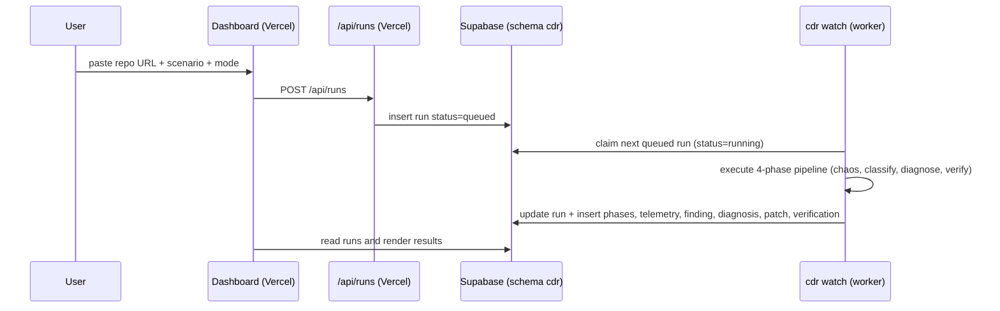

# Architecture

CDR has two planes: a **control plane** (web dashboard, deployed on Vercel) and a **data plane**
(runner, executing chaos and analysis close to the target environment).

```mermaid
flowchart LR
  subgraph Data plane
    K6[k6 load] --> TARGET[Online Boutique subset]
    TP[Toxiproxy fault injection] --> TARGET
    TARGET --> TEL[Telemetry capture]
    TEL --> CLS[Classifier rules]
    CLS --> WX[watsonx.ai Granite diagnosis]
    WX --> PAT[Patch generator]
    PAT --> VER[Verification re-run]
  end
  subgraph Control plane
    VER --> SB[(Supabase Postgres)]
    SB --> DASH[Next.js control room\nVercel]
  end
  BOB[IBM Bob 2.0] -. builds .-> Data plane
  BOB -. builds .-> Control plane
```

## Pipeline

| Phase | Module | Output |
| --- | --- | --- |
| 1. Chaos + collapse capture | `runner/cdr/telemetry.py`, `infra/` | telemetry samples, peak p95/p99, error rate, time-to-collapse, log signals |
| 2. Classification | `runner/cdr/classifier.py` | failure category + confidence + evidence + suspect location |
| 3. Repository-aware diagnosis | `runner/cdr/diagnoser.py`, `watsonx.py` | analysis and concrete refactor plan (Granite, rule-based fallback) |
| 4. Patch + verification | `runner/cdr/patcher.py`, `verifier.py` | diff, branch, before/after comparison, stability verdict |

## Repository submission flow



The submission API runs server-side on Vercel with the Supabase service role key; the key is
never exposed to the browser. The worker runs close to the target environment because live chaos
needs Docker.

## Failure categories and branching

Categories: `concurrency`, `memory_leak`, `unresilient_dependency`, `db_saturation`, `unknown`.

The classifier maps telemetry signals to a category. Known patterns (missing timeout, unbounded
pool, N+1 queries, unbounded cache) take the direct-fix path with a repository-consistent patch
template. The concurrency category is the differentiated path: the design supports parallel
subagents that bisect concurrent code under the same load to isolate the exact section before a
patch is proposed.

## Persistence

Supabase Postgres stores `projects`, `scenarios`, `runs`, `run_phases`, `telemetry_samples`,
`findings`, `diagnoses`, `patches` and `verifications`. The runner writes with the service role
key; the dashboard reads through RLS-protected public read policies and refreshes active runs
every 10 seconds.

## Modes

- **Mock mode** (`--mode mock`, default): deterministic telemetry simulation. The whole pipeline,
  report generation and dashboard sync run without Docker, k6 or Toxiproxy. This is the mode used
  for CI and for developing the demo UI.
- **Live mode** (`--mode live`): the chaos lab in `infra/` runs the real target stack. The runner
  keeps the same phases and data contracts, so switching modes changes no downstream code.

## Tech stack

| Layer | Choice |
| --- | --- |
| Dashboard | Next.js 16, TypeScript, Tailwind CSS 4, Recharts |
| Runner | Python 3.9+, httpx, PyYAML |
| AI | IBM watsonx.ai, IBM Granite (in-scope models only) |
| Data | Supabase Postgres, Storage, Realtime |
| Chaos lab | Docker Compose, k6, Toxiproxy, Pumba |
| Target | GoogleCloudPlatform/microservices-demo (Online Boutique subset) |
| Deployment | Vercel (dashboard), local runner first (IBM Cloud Code Engine as stretch) |

## Limitations (MVP)

- Live-mode wiring exists for the chaos lab endpoints, but the verified path used in the demo is
  mock mode plus a recorded live run; treat live orchestration as the next milestone.
- Automatic PR creation is guarded and off by default (`--create-pr`).
- Concurrency bisection is designed and scoped but implemented as the stretch path; the primary
  demo category is `unresilient_dependency`.
