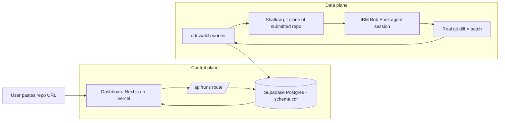

# Architecture

Two planes. The split exists because live chaos needs Docker and long-running processes, which
serverless platforms cannot host.

## Control plane

- **Dashboard** (Next.js 16, App Router, Tailwind 4, Recharts) on Vercel.
- **`/api/runs`** route inserts a `queued` run into Supabase using the service role key
  (server-side only, never exposed to the browser).
- **Supabase** persists runs, phases, telemetry, findings, diagnoses, patches and verifications
  in the isolated `cdr` schema (see [[Database and Supabase]]).
- The UI auto-refreshes active runs every 5 seconds and shows phase progress.

## Data plane

- **`cdr watch`** polls Supabase for the oldest `queued` run, atomically claims it
  (`status=running`) and executes the pipeline.
- **Bob Shell** runs one agent session per analysis inside a shallow clone under
  `artifacts/repos/<owner>-<name>`; the patch is the real `git diff` of Bob's edits, with only
  tracked source files accepted (see [[IBM Bob Integration]]).
- **Progress streaming**: every phase is published to `run_phases`, and the run status moves
  through `running → collapsed → diagnosing → patching → verifying → completed|failed`.

## Analyzer precedence

`CDR_ANALYZER=auto` (default):

1. **Bob Shell** — if `BOB_API_KEY` is available and `CDR_BOB_PATCHES=1`.
2. **watsonx.ai Granite** — if `WATSONX_API_KEY` + `WATSONX_PROJECT_ID` are set.
3. **Deterministic rules** — offline fallback (`rule-based-fallback`), template patch.

Force a single source with `CDR_ANALYZER=bob|watsonx|rules`. Guardrails:
`CDR_BOB_MAX_COST`, `CDR_BOB_PATCH_MAX_COST`, `CDR_BOB_TIMEOUT_S`, `CDR_CLONE_REPOS`.

## Tech stack

| Layer | Choice |
| --- | --- |
| Dashboard | Next.js 16, TypeScript, Tailwind CSS 4, Recharts |
| Runner | Python 3.9+, httpx, PyYAML |
| Runtime AI | IBM Bob Shell (default), IBM watsonx Granite (alternative) |
| Data | Supabase Postgres, RLS, Realtime, service-role writes |
| Chaos lab | Docker Compose, k6, Toxiproxy, Pumba |
| Target repo | GoogleCloudPlatform/microservices-demo subset + any submitted GitHub repo |
| Deployment | Vercel (dashboard), local worker (IBM Cloud Code Engine as stretch) |

## Limitations

- Mock-mode telemetry is simulated deterministically; live orchestration uses the same code
  paths but needs the `infra/` lab running (see [[Runbook]]).
- Automatic PR creation exists (`--create-pr`, `Patcher.create_pull_request`) but is off by
  default.
- Bob may pick a broader or more generic fix than desired; prompts are tuned but not perfect
  (see [[Known Issues and Gotchas]]).
